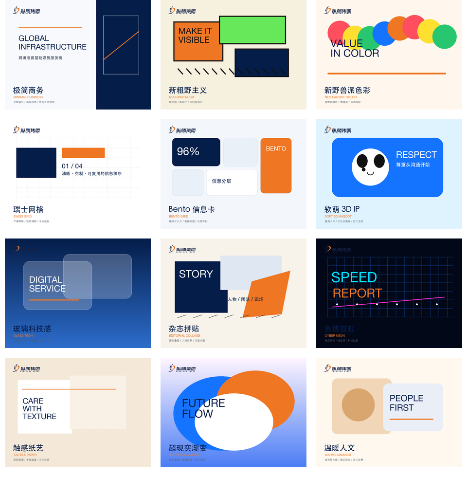

# Zongteng Brand Poster Skill

<p align="center">
  <a href="#中文说明"></a>
  <a href="#english-guide"></a>
</p>

面向纵腾集团品牌与文化海报的 Codex Skill。安装后，用户无需每次重复提供纵腾 logo、品牌色、价值观 IP、HRAS 标识或投屏规范，即可通过引导式问答生成带纵腾识别度的海报。

This is a Codex Skill for creating Zongteng-branded posters and culture visuals. After installation, users can generate posters with Zongteng logo assets, brand colors, value IP mascots, HRAS identity, and meeting-room poster rules without re-uploading brand materials each time.



## 中文说明

<p align="right"><a href="#english-guide">Switch to English</a></p>

### 这个 Skill 能做什么

- 生成纵腾集团品牌海报、文化海报、活动海报、价值观海报、员工关怀海报、评优/表彰海报。
- 支持 HRAS / 人力综合条线相关海报。
- 支持会议室投屏、飞书传播图、长图海报、方图、横幅、A4/A3 打印海报等格式。
- 通过引导式问题收集需求，也支持用户不填写完整信息，由 Codex 根据主题自动判断风格、受众、版式和文案。
- 默认使用 HTML/CSS 生成海报，再导出 PNG/PDF，避免 AI 直接生图导致中文文字错乱。

### 安装方式

在 Codex 环境中运行：

```bash
python3 ~/.codex/skills/.system/skill-installer/scripts/install-skill-from-github.py --repo finebyme99/zongteng-brand-poster --path . --name zongteng-brand-poster
```

安装完成后重启 Codex，让新 Skill 生效。

### 基础用法

在 Codex 中输入：

```text
Use $zongteng-brand-poster to create a Zongteng culture poster.
```

或直接中文说明需求：

```text
用 $zongteng-brand-poster 做一张纵腾价值观海报，主题是尊重，面向全体员工。
```

如果信息不完整，Skill 会引导你填写：

- 海报视觉风格
- 面向人群
- 海报尺寸/格式
- 内容布局
- 标题、副标题、正文、CTA
- 是否使用集团 logo、HRAS logo、价值观 IP、投屏模板、照片或二维码
- 其他要求

如果你不想填写，可以直接说：

```text
用 $zongteng-brand-poster 做一张纵腾内部活动海报，其他你来定。
```

### 可选视觉风格

内置 12 个海报视觉方向：

- 极简商务
- 新粗野主义
- 新野兽派色彩
- 瑞士网格
- Bento 信息卡
- 软萌 3D IP
- 玻璃科技感
- 杂志拼贴
- 赛博霓虹
- 触感纸艺
- 超现实渐变
- 温暖人文

这些风格不是 PPT 模板，而是海报视觉方向。最终产物应是单张海报、长图海报或屏幕海报。

### 输出原则

默认输出：

- `poster.html`：可编辑 HTML/CSS 源文件
- `poster.png`：可分享图片
- `poster.pdf`：可选打印/归档文件

重要约束：

- 不默认生成 PPT/PPTX。
- 不生成多页幻灯片。
- 不用 AI 图片模型直接生成包含中文文字的整张海报。
- 中文标题、正文、日期、部门、姓名等必须保留为 HTML 真实文本，再通过浏览器截图导出。
- logo 必须使用仓库内原始素材，不要重画、改色、拉伸或变形。

### HTML 海报导出

仓库提供导出脚本：

```bash
node scripts/export-html-poster.mjs poster.html poster.png --width 1080 --height 1440
node scripts/export-html-poster.mjs poster.html poster.pdf --width 1080 --height 1440 --pdf
```

脚本依赖 Playwright。如果首次运行提示缺少浏览器，请按提示安装 Chromium。

### 适合的使用示例

```text
用 $zongteng-brand-poster 做一张 1080x1440 纵腾价值观海报，主题是共赢，风格活泼一点。
```

```text
用 $zongteng-brand-poster 做一张 HRAS 招新活动海报，面向内部员工，帮我写文案。
```

```text
用 $zongteng-brand-poster 做一张会议室 16:9 投屏海报，主题是月度评优。
```

```text
用 $zongteng-brand-poster 做一张长图海报，介绍纵腾文化活动流程，风格用 Bento 信息卡。
```

## English Guide

<p align="right"><a href="#中文说明">切换到中文</a></p>

### What This Skill Does

- Creates Zongteng Group brand posters, culture posters, campaign posters, value posters, employee care posters, and recognition posters.
- Supports HRAS / People Operations posters.
- Supports meeting-room screen posters, Feishu/social images, long posters, square cards, banners, and A4/A3 print posters.
- Guides users through a short brief, while also supporting automatic decisions when users leave fields blank.
- Uses HTML/CSS first, then exports PNG/PDF, so Chinese text remains accurate and readable.

### Installation

Run this in your Codex environment:

```bash
python3 ~/.codex/skills/.system/skill-installer/scripts/install-skill-from-github.py --repo finebyme99/zongteng-brand-poster --path . --name zongteng-brand-poster
```

Restart Codex after installation.

### Basic Usage

In Codex, type:

```text
Use $zongteng-brand-poster to create a Zongteng culture poster.
```

You can also provide a more specific request:

```text
Use $zongteng-brand-poster to create a Zongteng value poster about Respect for all employees.
```

When details are missing, the Skill guides you through:

- Visual style
- Audience
- Poster format
- Content layout
- Title, subtitle, body copy, and CTA
- Required brand or IP elements
- Other constraints

If you want Codex to decide, say:

```text
Use $zongteng-brand-poster to create an internal campaign poster. Decide the rest for me.
```

### Visual Style Options

The Skill includes 12 poster style directions:

- Minimal Business
- Neo Brutalism
- Neo Fauvist Color
- Swiss Grid
- Bento Grid
- Soft 3D Mascot
- Glass Tech
- Editorial Collage
- Cyber Neon
- Tactile Paper
- Surreal Gradient
- Warm Humanist

These are poster design directions, not PowerPoint templates. The expected output is a single poster, a long poster, or a screen poster.

### Output Principles

Default outputs:

- `poster.html`: editable HTML/CSS source
- `poster.png`: shareable image
- `poster.pdf`: optional print/archive export

Important rules:

- Do not generate PPT/PPTX by default.
- Do not create slide decks.
- Do not use AI image generation for a full poster containing Chinese text.
- Keep Chinese titles, body copy, dates, departments, and names as real HTML text before browser export.
- Use bundled original logo assets. Do not redraw, recolor, stretch, or distort the logo.

### Exporting HTML Posters

Use the bundled export script:

```bash
node scripts/export-html-poster.mjs poster.html poster.png --width 1080 --height 1440
node scripts/export-html-poster.mjs poster.html poster.pdf --width 1080 --height 1440 --pdf
```

The script uses Playwright. If Chromium is missing on first run, follow the Playwright prompt to install it.

### Example Prompts

```text
Use $zongteng-brand-poster to create a 1080x1440 poster for the value Win-Win. Make it energetic and employee-facing.
```

```text
Use $zongteng-brand-poster to create an HRAS recruiting activity poster for internal employees. Help write the copy.
```

```text
Use $zongteng-brand-poster to create a 16:9 meeting-room screen poster for monthly recognition.
```

```text
Use $zongteng-brand-poster to create a long poster explaining a Zongteng culture activity flow. Use a Bento Grid style.
```

## Repository Structure

```text
.
├── SKILL.md
├── agents/openai.yaml
├── references/
├── assets/
└── scripts/export-html-poster.mjs
```

## Notes

This repository includes Zongteng brand and culture assets for poster generation. Keep generated outputs aligned with the included VI rules and value IP mapping.
