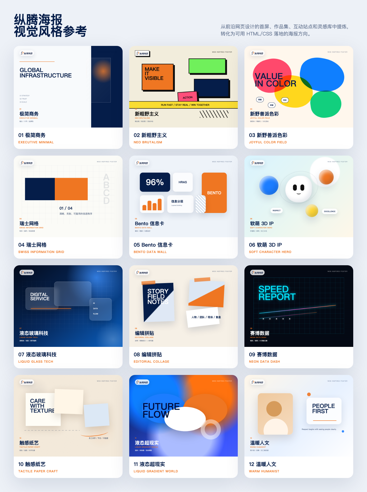

# Zongteng Brand Poster Agent Kit

<p align="center">
  <a href="#中文说明"></a>
  <a href="#english-guide"></a>
</p>

面向纵腾集团品牌与文化海报的通用 AI Agent 设计包。真正可安装的 Agent Kit 位于 `zongteng-brand-poster/` 子目录。任何能读取仓库文件并生成 HTML/CSS 的 AI Agent，都可以通过本仓库直接复用纵腾 logo、品牌色、价值观 IP、HRAS 标识、投屏规范和海报风格参考。

This is an agent-compatible poster design kit for Zongteng-branded visuals. The installable agent kit lives in the `zongteng-brand-poster/` subdirectory. Any AI agent that can read repository files and generate HTML/CSS can reuse the bundled Zongteng logo assets, brand colors, value IP mascots, HRAS identity, meeting-room poster rules, and poster style references.



## 中文说明

<p align="right"><a href="#english-guide">Switch to English</a></p>

### 这个 Agent Kit 能做什么

- 生成纵腾集团品牌海报、文化海报、活动海报、价值观海报、员工关怀海报、评优/表彰海报。
- 支持 HRAS / 人力综合条线相关海报。
- 支持会议室投屏、飞书传播图、长图海报、方图、横幅、A4/A3 打印海报等格式。
- 通过引导式问题收集需求，也支持用户选择内置风格、混合风格、描述期望风格，或不填写完整信息由 AI Agent 自动判断。
- 默认使用 HTML/CSS 生成海报，再导出 PNG/PDF，避免 AI 直接生图导致中文文字错乱。
- 强制强调海报设计感：不做 PPT 风格，不做普通信息卡片页，不做只有网格、圆环和卡片的模板化画面。

### 通用使用方式

1. 克隆或下载这个公开仓库：

```bash
git clone https://github.com/finebyme99/zongteng-brand-poster.git
```

2. 在任意 AI Agent 中打开这个仓库，或把仓库链接/文件提供给 Agent。

3. 让 Agent 先读取通用入口：

```text
请先读取 zongteng-brand-poster/AGENTS.md，然后按这个仓库里的纵腾品牌规范、素材和风格参考，帮我生成一张海报。
```

如果你的 Agent 会自动读取仓库指令文件，可以直接提出需求：

```text
做一张纵腾价值观海报，主题是尊重，面向全体员工，风格偏年轻但保持品牌感。
```

### 已适配的 Agent 入口

- `zongteng-brand-poster/AGENTS.md`：通用 AI Agent 主入口，推荐所有 Agent 读取。
- `zongteng-brand-poster/CLAUDE.md`：Claude / Claude Code 入口。
- `zongteng-brand-poster/GEMINI.md`：Gemini CLI / Gemini Agent 入口。
- `zongteng-brand-poster/.cursor/rules/zongteng-brand-poster.mdc` 和 `zongteng-brand-poster/.cursorrules`：Cursor 入口。
- `zongteng-brand-poster/.windsurfrules`：Windsurf 入口。
- `zongteng-brand-poster/SKILL.md` 和 `zongteng-brand-poster/agents/openai.yaml`：OpenAI / Codex 兼容入口，保留为可选安装方式。

### OpenAI / Codex 兼容安装（可选）

如果你使用支持 Skill 安装的 OpenAI / Codex 环境，推荐运行完整安装脚本：

```bash
./scripts/install-codex-full.sh
```

或者使用官方 installer，但必须安装子目录，不能用 `--path .`：

```bash
python3 ~/.codex/skills/.system/skill-installer/scripts/install-skill-from-github.py --repo finebyme99/zongteng-brand-poster --path zongteng-brand-poster --name zongteng-brand-poster --method git
```

不要使用旧命令 `--path .`。在 Codex 的 sparse checkout 安装路径下，它可能只装根目录文件，漏掉 `references/`、`assets/`、`scripts/`，导致生成效果退化。安装完成后重启对应 Agent，让新入口生效。

### 引导式填写内容

新建海报任务时，Agent 默认必须先引导你填写并等待回复；只有你明确说“直接生成 / 不用问 / 按默认来 / 其他你定”时，才会直接生成。

Agent 会引导你填写：

- 海报视觉风格：可选示例风格、混合两个风格、直接描述期望风格，或留空自动判断
- 面向人群
- 海报尺寸/格式
- 内容布局
- 标题、副标题、正文、CTA
- 是否使用集团 logo、HRAS logo、价值观 IP、投屏模板、照片或二维码
- 其他要求

如果你不想填写，可以直接说：

```text
做一张纵腾内部活动海报，其他你来定。
```

### 可选视觉风格

内置 12 个海报视觉方向，参考前沿网页设计站点中的首屏、作品集、互动站和设计灵感库趋势，重新转化为海报风格卡：

- 极简商务
- 新粗野主义
- 新野兽派色彩
- 瑞士网格
- Bento 信息卡
- 软萌 3D IP
- 液态玻璃科技
- 杂志拼贴
- 赛博数据
- 触感纸艺
- 液态超现实
- 温暖人文

这些风格不是 PPT 模板，也不是直接复制网页截图，而是可用 HTML/CSS 落地的海报视觉方向。你也可以直接描述想要的感觉，例如“像高端科技官网首屏”“像设计工作室作品集”“更年轻、更有冲击力”，Agent 会映射到最接近的风格或生成自定义方向。

### 输出原则

默认输出：

- `poster.html`：可编辑 HTML/CSS 源文件
- `poster.png`：可分享图片
- `poster.pdf`：可选打印/归档文件

重要约束：

- 不默认生成 PPT/PPTX。
- 不生成多页幻灯片。
- 不生成 PPT 风格海报：避免居中大标题 + 等分卡片、淡网格背景 + 圆环图标、仪表盘式信息页。
- 必须有主视觉或 campaign poster 级别的画面概念，例如笔刷能量、IP 角色主视觉、编辑拼贴、科技竞技场、强动势背景等。
- 不用 AI 图片模型直接生成包含中文文字的整张海报。
- 中文标题、正文、日期、部门、姓名等必须保留为 HTML 真实文本，再通过浏览器截图导出。
- logo 必须使用仓库内原始素材，不要重画、改色、拉伸或变形。

### HTML 海报导出

仓库提供导出脚本：

```bash
node zongteng-brand-poster/scripts/export-html-poster.mjs poster.html poster.png --width 1080 --height 1440
node zongteng-brand-poster/scripts/export-html-poster.mjs poster.html poster.pdf --width 1080 --height 1440 --pdf
```

脚本依赖 Playwright。如果首次运行提示缺少浏览器，请按提示安装 Chromium。

### 适合的使用示例

```text
请读取 zongteng-brand-poster/AGENTS.md，做一张 1080x1440 纵腾价值观海报，主题是共赢，风格活泼一点。
```

```text
基于这个仓库的纵腾规范，做一张 HRAS 招新活动海报，面向内部员工，帮我写文案。
```

```text
做一张会议室 16:9 投屏海报，主题是月度评优。
```

```text
做一张长图海报，介绍纵腾文化活动流程，风格用 Bento 信息卡。
```

## English Guide

<p align="right"><a href="#中文说明">切换到中文</a></p>

### What This Agent Kit Does

- Creates Zongteng Group brand posters, culture posters, campaign posters, value posters, employee care posters, and recognition posters.
- Supports HRAS / People Operations posters.
- Supports meeting-room screen posters, Feishu/social images, long posters, square cards, banners, and A4/A3 print posters.
- Guides users through a short brief, while supporting built-in style choices, mixed styles, custom style descriptions, and automatic decisions when users leave fields blank.
- Uses HTML/CSS first, then exports PNG/PDF, so Chinese text remains accurate and readable.
- Enforces poster-level visual design: no PPT-style layouts, no plain information-card pages, and no generic grid/circle/card templates.

### Generic Usage

1. Clone or download this public repository:

```bash
git clone https://github.com/finebyme99/zongteng-brand-poster.git
```

2. Open the repository in any AI agent, or provide the repository link/files to the agent.

3. Ask the agent to read the generic entry point first:

```text
Read zongteng-brand-poster/AGENTS.md first, then use the Zongteng brand rules, assets, and style references in this repository to create a poster.
```

If your agent automatically reads repository instruction files, you can directly provide the poster brief:

```text
Create a Zongteng value poster about Respect for all employees. Make it youthful while keeping the brand recognizable.
```

### Supported Agent Entry Points

- `zongteng-brand-poster/AGENTS.md`: generic entry point for AI agents; recommended for all agents.
- `zongteng-brand-poster/CLAUDE.md`: Claude / Claude Code entry point.
- `zongteng-brand-poster/GEMINI.md`: Gemini CLI / Gemini Agent entry point.
- `zongteng-brand-poster/.cursor/rules/zongteng-brand-poster.mdc` and `zongteng-brand-poster/.cursorrules`: Cursor entry points.
- `zongteng-brand-poster/.windsurfrules`: Windsurf entry point.
- `zongteng-brand-poster/SKILL.md` and `zongteng-brand-poster/agents/openai.yaml`: OpenAI / Codex-compatible optional entry points.

### OpenAI / Codex-Compatible Installation Optional

If you use an OpenAI / Codex environment that supports Skill installation, use the full installer script:

```bash
./scripts/install-codex-full.sh
```

Or use the official installer, but install the subdirectory. Do not use `--path .`:

```bash
python3 ~/.codex/skills/.system/skill-installer/scripts/install-skill-from-github.py --repo finebyme99/zongteng-brand-poster --path zongteng-brand-poster --name zongteng-brand-poster --method git
```

The old `--path .` command may install only root files under Codex sparse checkout and miss `references/`, `assets/`, and `scripts/`. Restart the corresponding agent after installation.

### Guided Brief Fields

For new poster tasks, the agent must guide you first and wait for your answer. It should only generate directly when you explicitly say "directly generate", "decide for me", "use defaults", or equivalent.

The guided fields are:

- Visual style: choose a sample style, mix two styles, describe the desired style, or leave it blank for automatic selection
- Audience
- Poster format
- Content layout
- Title, subtitle, body copy, and CTA
- Required brand or IP elements
- Other constraints

If you want the agent to decide, say:

```text
Create an internal Zongteng campaign poster. Decide the rest for me.
```

### Visual Style Options

The kit includes 12 poster style directions, refreshed from current web-design inspiration patterns such as hero pages, portfolios, interactive sites, and curated design galleries:

- Minimal Business
- Neo Brutalism
- Neo Fauvist Color
- Swiss Grid
- Bento Grid
- Soft 3D Mascot
- Liquid Glass Tech
- Editorial Collage
- Neon Data Dash
- Tactile Paper
- Liquid Gradient World
- Warm Humanist

These are poster design directions, not PowerPoint templates or copied website screenshots. You can also describe the style you want, such as "premium tech landing page", "design studio portfolio", or "younger and more high-impact"; the agent will map it to the closest style or create a custom Zongteng-compliant direction.

### Output Principles

Default outputs:

- `poster.html`: editable HTML/CSS source
- `poster.png`: shareable image
- `poster.pdf`: optional print/archive export

Important rules:

- Do not generate PPT/PPTX by default.
- Do not create slide decks.
- Do not generate PPT-style posters: avoid centered headline plus equal cards, pale grid plus rings/icons, and dashboard-like information pages.
- Use a strong hero visual or campaign-poster concept: brush energy, IP/mascot hero, editorial collage, tech arena, motion background, or equivalent.
- Do not use AI image generation for a full poster containing Chinese text.
- Keep Chinese titles, body copy, dates, departments, and names as real HTML text before browser export.
- Use bundled original logo assets. Do not redraw, recolor, stretch, or distort the logo.

### Exporting HTML Posters

Use the bundled export script:

```bash
node zongteng-brand-poster/scripts/export-html-poster.mjs poster.html poster.png --width 1080 --height 1440
node zongteng-brand-poster/scripts/export-html-poster.mjs poster.html poster.pdf --width 1080 --height 1440 --pdf
```

The script uses Playwright. If Chromium is missing on first run, follow the Playwright prompt to install it.

### Example Prompts

```text
Read zongteng-brand-poster/AGENTS.md and create a 1080x1440 Zongteng value poster for Win-Win. Make it energetic and employee-facing.
```

```text
Use this repository's Zongteng rules to create an HRAS recruiting activity poster for internal employees. Help write the copy.
```

```text
Create a 16:9 meeting-room screen poster for monthly recognition.
```

```text
Create a long poster explaining a Zongteng culture activity flow. Use a Bento Grid style.
```

## Repository Structure

```text
.
├── AGENTS.md
├── CLAUDE.md
├── GEMINI.md
├── .cursor/rules/zongteng-brand-poster.mdc
├── .cursorrules
├── .windsurfrules
├── scripts/install-codex-full.sh
└── zongteng-brand-poster/
    ├── AGENTS.md
    ├── SKILL.md
    ├── agents/openai.yaml
    ├── references/
    ├── assets/
    └── scripts/
```

## Notes

This repository includes Zongteng brand and culture assets for poster generation. Keep generated outputs aligned with the included VI rules and value IP mapping.
